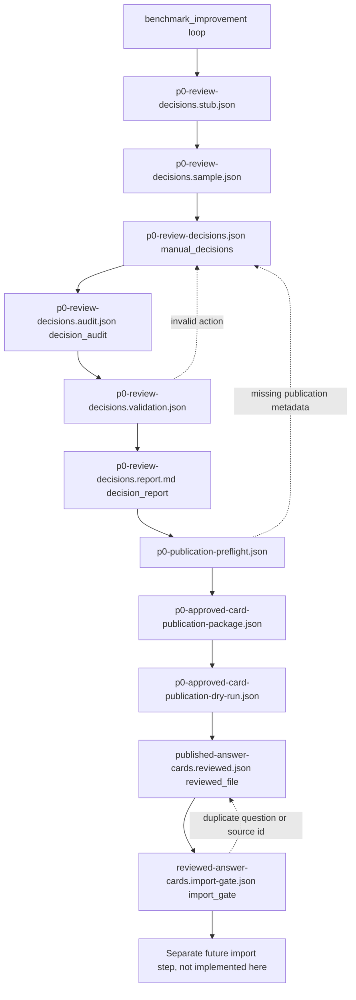

# HXY P0 Answer Card Governance Runbook

This runbook defines the manual governance path for turning P0 benchmark authority gaps into reviewed answer card files.

It is intentionally conservative. The loop may prepare artifacts, validate metadata, detect conflicts, and render draft payloads. It must not silently publish authority.

## Scope

This runbook applies to P0 risk-boundary answer cards generated from `knowledge/benchmarks/hxy-brain-benchmark-v1.json`, especially medical, effect-guarantee, exaggerated-marketing, and overclaim-risk cases.

It does not import cards into the database. It does not modify built-in benchmark approved cards. It does not turn candidate claims, draft cards, or process memory into authority.

## Non-Negotiable Rules

- 不得自动批准 candidate / draft / process memory.
- 不得把 dry-run payload 当 approved answer card.
- 不得跳过 import gate.
- `write_to_database: false` must remain true for the runbook flow.
- `would_import_count: 0` must remain true until a separate database import procedure is explicitly designed and reviewed.
- A reviewed file is not the same as a database import.
- A valid import gate report only means "ready for a separate import step"; it does not import anything.

## State Diagram



## Artifact Contract

| Step | Artifact | Owner | Authority Status |
|---|---|---|---|
| 1 | `p0-review-decisions.stub.json` | Loop | Not authority |
| 2 | `p0-review-decisions.sample.json` | Loop / operator | Not authority |
| 3 | `p0-review-decisions.json` | Operations / compliance reviewer | Manual decision input |
| 4 | `p0-review-decisions.audit.json` / `p0-review-decisions.audit.md` | Auditor | Read-only manual edit audit, not authority |
| 5 | `p0-reviewer-worksheet.md` | Reviewer aid | Read-only worksheet, not authority |
| 6 | `p0-reviewer-todo.json` | Reviewer aid / UI queue | Read-only machine-readable review queue, not authority |
| 7 | `p0-review-decisions.validation.json` | Validator | Not authority |
| 8 | `p0-review-decisions.report.md` | Validator | Human-readable report, not authority |
| 9 | `p0-publication-preflight.json` | Loop | Not authority |
| 10 | `p0-approved-card-publication-package.json` | Loop | Publication candidate package, not authority |
| 11 | `p0-approved-card-publication-dry-run.json` | Publisher dry-run | Draft payload only |
| 12 | `published-answer-cards.reviewed.json` | Explicit manual publication | Reviewed file, not database import |
| 13 | `reviewed-answer-cards.import-gate.json` | Import gate | Checks only, no write |

## Artifact Freshness

Every downstream artifact carries a fingerprint of the upstream artifact it was built from.

The status checker treats these files as stale if the upstream fingerprint no longer matches:

| Downstream Artifact | Upstream Fingerprint |
|---|---|
| `p0-review-decisions.audit.json` | `sample_fingerprint` and `decision_fingerprint` |
| `p0-review-decisions.audit.md` | `audit_fingerprint_digest`, plus `sample_fingerprint_digest` and `decision_fingerprint_digest` for reviewer traceability |
| `p0-review-decisions.report.md` | `decision_fingerprint_digest` |
| `p0-publication-preflight.json` | `decision_fingerprint` |
| `p0-approved-card-publication-package.json` | `validation_fingerprint` |
| `p0-approved-card-publication-dry-run.json` | `publication_package_fingerprint` |
| `published-answer-cards.reviewed.json` | `dry_run_fingerprint` |
| `reviewed-answer-cards.import-gate.json` | `reviewed_file_fingerprint` and `existing_answer_cards_fingerprint` |

If any upstream file is manually edited, rerun all downstream gates. Do not continue from an older artifact.

## Commands

Run safe-next to advance all safe read-only/manual-aid artifacts until a human gate:

```bash
.venv/bin/python scripts/run-hxy-p0-governance-safe-next.py \
  --run-dir knowledge/runs/benchmark-loop-latest \
  --benchmark knowledge/benchmarks/hxy-brain-benchmark-v1.json \
  --report knowledge/reports/benchmark-latest.json \
  --max-steps 8
```

The safe-next runner only executes allowlisted `validate-hxy-p0-review-decisions.py` commands for sample, review packet, pending-only initialization, edit guide, decision audit, reviewer worksheet, reviewer todo, validation, and decision report. It does not run publish, import, dry-run publication, or benchmark loop commands. It stops with `human_decision_required` when the next required step is a real manual decision in `p0-review-decisions.json`.

Render a read-only product dry-run report for UI / Hermes / Feishu debugging:

```bash
.venv/bin/python scripts/report-hxy-p0-governance-dry-run.py \
  --run-dir knowledge/runs/benchmark-loop-latest \
  --run-id benchmark-loop-latest \
  --benchmark knowledge/benchmarks/hxy-brain-benchmark-v1.json \
  --report knowledge/reports/benchmark-latest.json \
  --output knowledge/runs/benchmark-loop-latest/p0-governance-dry-run-report.json
```

The dry-run report prints the current safe-next stop reason and product-facing API payloads in one JSON file. Its authority rule is `dry_run_report_does_not_execute_safe_next`; it does not execute safe-next commands, edit `p0-review-decisions.json`, publish answer cards, import cards, or write to a database.

Run the benchmark loop and generate the decision stub:

```bash
.venv/bin/python scripts/run-hxy-loop.py benchmark_improvement \
  --benchmark knowledge/benchmarks/hxy-brain-benchmark-v1.json \
  --report knowledge/reports/benchmark-latest.json \
  --run-id benchmark-loop-latest \
  --runs-dir knowledge/runs \
  --max-iterations 1
```

Create the editable sample:

```bash
.venv/bin/python scripts/validate-hxy-p0-review-decisions.py sample \
  --stub knowledge/runs/benchmark-loop-latest/p0-review-decisions.stub.json \
  --output knowledge/runs/benchmark-loop-latest/p0-review-decisions.sample.json
```

Create a read-only manual review packet for reviewers:

```bash
.venv/bin/python scripts/validate-hxy-p0-review-decisions.py review-packet \
  --stub knowledge/runs/benchmark-loop-latest/p0-review-decisions.stub.json \
  --drafts knowledge/runs/benchmark-loop-latest/p0-authority-card-drafts.json \
  --manifest knowledge/runs/benchmark-loop-latest/p0-draft-review-manifest.json \
  --sample knowledge/runs/benchmark-loop-latest/p0-review-decisions.sample.json \
  --output-json knowledge/runs/benchmark-loop-latest/p0-manual-review-packet.json \
  --output-md knowledge/runs/benchmark-loop-latest/p0-manual-review-packet.md
```

The manual review packet is only a reviewer aid. It does not create `p0-review-decisions.json`, approve cards, publish cards, or write to a database.

The status checker reports `needs_manual_review_packet` until both `p0-manual-review-packet.json` and `p0-manual-review-packet.md` exist. After that, it reports `awaiting_manual_decisions` and points reviewers to `p0-manual-review-packet.md`.

Initialize a pending-only `p0-review-decisions.json` from the sample:

```bash
.venv/bin/python scripts/validate-hxy-p0-review-decisions.py init-decisions \
  --sample knowledge/runs/benchmark-loop-latest/p0-review-decisions.sample.json \
  --output knowledge/runs/benchmark-loop-latest/p0-review-decisions.json
```

The initializer refuses to overwrite an existing decision file. It writes only `pending` actions and still blocks at `blocked_at_empty_manual_decisions` until a human edits at least one decision.

Optionally render a pending-decision edit guide:

```bash
.venv/bin/python scripts/validate-hxy-p0-review-decisions.py edit-guide \
  --packet knowledge/runs/benchmark-loop-latest/p0-manual-review-packet.json \
  --decisions knowledge/runs/benchmark-loop-latest/p0-review-decisions.json \
  --output-md knowledge/runs/benchmark-loop-latest/p0-decision-edit-guide.md
```

The edit guide is read-only. It lists pending case IDs, edit targets, allowed actions, and required metadata. It does not recommend an approval action and does not write answer cards.

The edit guide records both `review_packet_fingerprint_digest` and `decision_fingerprint_digest`. The status checker marks it `missing`, `stale`, or `fresh`; when it is fresh, `--human` output points reviewers directly to `p0-decision-edit-guide.md`.

Render a read-only audit of manual edits at any time:

```bash
.venv/bin/python scripts/validate-hxy-p0-review-decisions.py decision-audit \
  --sample knowledge/runs/benchmark-loop-latest/p0-review-decisions.sample.json \
  --decisions knowledge/runs/benchmark-loop-latest/p0-review-decisions.json \
  --output-json knowledge/runs/benchmark-loop-latest/p0-review-decisions.audit.json \
  --output-md knowledge/runs/benchmark-loop-latest/p0-review-decisions.audit.md
```

The audit compares the current decisions against the initial sample and reports changed, pending, and metadata-gap counts. It does not approve, publish, import, or write answer cards.

When a reviewer has changed any decision to `approve`, `reject`, or `needs_revision`, the status checker must report a fresh audit before validation can proceed. If the audit JSON or Markdown is missing, it reports `needs_decision_audit`. If `p0-review-decisions.json`, `p0-review-decisions.sample.json`, or the audit JSON changes after `p0-review-decisions.audit.md` was rendered, it reports `stale_decision_audit` and requires the `decision-audit` command again.

Optionally render a reviewer worksheet:

```bash
.venv/bin/python scripts/validate-hxy-p0-review-decisions.py reviewer-worksheet \
  --packet knowledge/runs/benchmark-loop-latest/p0-manual-review-packet.json \
  --decisions knowledge/runs/benchmark-loop-latest/p0-review-decisions.json \
  --audit knowledge/runs/benchmark-loop-latest/p0-review-decisions.audit.json \
  --output-md knowledge/runs/benchmark-loop-latest/p0-reviewer-worksheet.md
```

The worksheet collects each case's current action, edit target, risk flags, review questions, approval conditions, rejection conditions, and required publication metadata. It is only a reviewer aid. It does not modify `p0-review-decisions.json`, recommend an approval action, publish cards, import cards, or write to a database.

Optionally render a machine-readable reviewer todo queue for UI / Hermes / Feishu surfaces:

```bash
.venv/bin/python scripts/validate-hxy-p0-review-decisions.py reviewer-todo \
  --packet knowledge/runs/benchmark-loop-latest/p0-manual-review-packet.json \
  --decisions knowledge/runs/benchmark-loop-latest/p0-review-decisions.json \
  --audit knowledge/runs/benchmark-loop-latest/p0-review-decisions.audit.json \
  --output-json knowledge/runs/benchmark-loop-latest/p0-reviewer-todo.json
```

The todo queue mirrors the worksheet in JSON form: case ID, current action, edit target, risk flags, review questions, approval conditions, rejection conditions, and required metadata. It is not a decision file and cannot approve, publish, import, or write answer cards.

Expose the generated queue through the HXY-owned read-only API for UI / Hermes / Feishu consumers:

```text
GET /api/v1/hxy/p0/reviewer-todo
GET /api/v1/hxy/p0/reviewer-todo?run_id=benchmark-loop-latest
```

The API only reads `knowledge/runs/<run_id>/p0-reviewer-todo.json`. It must return `official_use_allowed: false`, `publish_allowed: false`, `write_to_database: false`, and `requires_human_review: true`. It must not edit `p0-review-decisions.json`, create review tasks, publish cards, import cards, or touch any htops path.

Expose the current P0 gate status through the HXY-owned read-only status API:

```text
GET /api/v1/hxy/p0/governance-status
GET /api/v1/hxy/p0/governance-status?run_id=benchmark-loop-latest
```

The status API wraps the same `build_p0_governance_status` logic used by `scripts/check-hxy-p0-governance-status.py`. It is a product-facing view of the current gate, next action, next command, fresh/stale artifacts, and reviewer todo URL. It must keep `write_to_database: false`, `publish_allowed: false`, and `official_use_allowed: false`.

Preview a proposed manual decision payload before editing the real decision file:

```text
POST /api/v1/hxy/p0/decision-preview
POST /api/v1/hxy/p0/decision-preview?run_id=benchmark-loop-latest
```

Request body:

```json
{
  "decisions": {
    "version": "hxy-p0-review-decisions.v1",
    "items": []
  }
}
```

The preview API validates the submitted `decisions` payload against `p0-review-decisions.stub.json` and returns validation plus publication preflight details. It must not write `p0-review-decisions.json`. Its authority rule is `decision_preview_validates_payload_without_writing_manual_decisions`.

For every human-edited `approve`, fill all publication metadata:

```text
source_references
knowledge_version
responsible_owner
effective_scope
risk_review_status
```

Validate manual decisions:

```bash
.venv/bin/python scripts/validate-hxy-p0-review-decisions.py validate \
  --stub knowledge/runs/benchmark-loop-latest/p0-review-decisions.stub.json \
  --decisions knowledge/runs/benchmark-loop-latest/p0-review-decisions.json \
  --output knowledge/runs/benchmark-loop-latest/p0-review-decisions.validation.json
```

Render a reviewer-readable decision report:

```bash
.venv/bin/python scripts/validate-hxy-p0-review-decisions.py decision-report \
  --stub knowledge/runs/benchmark-loop-latest/p0-review-decisions.stub.json \
  --decisions knowledge/runs/benchmark-loop-latest/p0-review-decisions.json \
  --output-json knowledge/runs/benchmark-loop-latest/p0-review-decisions.validation.json \
  --output-md knowledge/runs/benchmark-loop-latest/p0-review-decisions.report.md
```

The decision report only summarizes decisions, validation errors, and publication metadata gaps. It does not approve, publish, import, or write answer cards.

The status checker reports `needs_decision_report` until `p0-review-decisions.report.md` exists. If the report fingerprint no longer matches the current decisions, it reports `stale_decision_report` and requires the `decision-report` command again.

Re-run benchmark loop after a valid `p0-review-decisions.json` exists. This produces:

```text
p0-review-decision-summary.json
p0-publication-preflight.json
p0-review-decisions.validation.json
p0-approved-card-publication-package.json
```

Render dry-run payloads:

```bash
.venv/bin/python scripts/publish-hxy-p0-answer-cards.py dry-run \
  --package knowledge/runs/benchmark-loop-latest/p0-approved-card-publication-package.json \
  --output knowledge/runs/benchmark-loop-latest/p0-approved-card-publication-dry-run.json
```

The dry-run report must show:

```text
write_to_formal_store: false
publish_allowed: false
would_write_count: 0
```

Only after a human confirms the dry-run payloads, write the reviewed file:

```bash
.venv/bin/python scripts/publish-hxy-p0-answer-cards.py publish \
  --dry-run knowledge/runs/benchmark-loop-latest/p0-approved-card-publication-dry-run.json \
  --output knowledge/runs/benchmark-loop-latest/published-answer-cards.reviewed.json \
  --confirm-manual-publication
```

Run the import gate against existing approved answer cards:

```bash
.venv/bin/python scripts/import-hxy-p0-reviewed-answer-cards.py gate \
  --reviewed knowledge/runs/benchmark-loop-latest/published-answer-cards.reviewed.json \
  --existing knowledge/runs/benchmark-loop-latest/existing-answer-cards.json \
  --output knowledge/runs/benchmark-loop-latest/reviewed-answer-cards.import-gate.json
```

The import gate report must show:

```text
write_to_database: false
would_import_count: 0
```

## Reviewer Checklist

Before changing `action` to `approve`, the reviewer must confirm:

- The answer blocks medical diagnosis and treatment claims where relevant.
- The answer blocks guaranteed effect or time-to-effect claims where relevant.
- The answer blocks "best", "first", "far better than peers", and similar exaggerated claims.
- The wording can be used by first-store staff without extra explanation.
- The card has source references, knowledge version, responsible owner, effective scope, and risk review status.

## Stop Conditions

Stop and revise `p0-review-decisions.json` when:

- status checker reports `blocked_at_empty_manual_decisions`;
- status checker reports `needs_decision_audit`;
- status checker reports `stale_decision_audit`;
- validation reports `invalid_action`;
- validation reports `missing_publication_metadata`;
- preflight reports `blocked_missing_publication_metadata`;
- dry-run reports missing answer card fields;
- import gate reports `duplicate_question_intent`;
- import gate reports `duplicate_source_answer_id`.
- status checker reports any stale downstream artifact fingerprint.

## What This Flow Does Not Do

This flow does not write to `hxy_knowledge_answer_cards`.

This flow does not import `published-answer-cards.reviewed.json` into PostgreSQL.

This flow does not make a reviewed file available to answer retrieval by itself.

This flow only produces reviewed, auditable, conflict-checked files for a future explicit import procedure.
